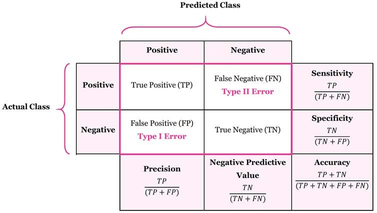

```{r setup, warning=FALSE}
knitr::opts_chunk$set(echo = TRUE,
                      warning = FALSE,
                      message = FALSE)
```

## Introduction

The aim of this project is to build a machine learning model to predict the 
outcome of a round from the video game Tom Clancy's Rainbow Six Siege. 
Tom Clancy’s Rainbow Six Siege is a competitive, tactical first-person shooter 
in which two teams play against each other in objective-based game modes. Each 
team consists of five players who choose operators with unique abilities and both 
teams take turns defending and attacking an objective. This project will be 
trying several different machine learning algorithms to find the best performing 
model on this binary classification problem.

```{r echo=FALSE, out.width = "60%", fig.align = "center"}
knitr::include_graphics("../images/r6_logo.jpg")
```

The data set I will be using contains an observation for every player in every 
round played in Tom Clancy’s Rainbow Six Siege over the course of 3 months. I 
found the data set on Kaggle. The data were originally shared by Ubisoft in 2020, 
the game’s publisher, but were removed from the website because it is quite 
outdated. The link to the Kaggle data set is provided [here](https://www.kaggle.com/datasets/maxcobra/rainbow-six-siege-s5-ranked-dataset).

#### Disclaimer 

The data set contains roughly 88 million observations and is split into 22 csv 
files. However, I will be reducing the number to 5,000 observations in order to 
save memory.

## Data Pre-processing

```{r, warning=FALSE, message=FALSE}
library(tidyverse)
library(tidymodels)
library(dplyr)
library(ggplot2)
library(corrplot)
library(kknn)
library(glmnet)
library(naniar)
library(discrim)
library(ranger)
library(randomForest)
library(xgboost)
library(MASS)
library(kernlab)
library(vip)
library(caret)
library(e1071)
tidymodels_prefer()
conflicted::conflicts_prefer(kknn::contr.dummy)
```

We can start by checking for any missing values and dealing with them accordingly.

```{r}
data <- read.csv('../data/rainbow_data.csv')
```

```{r}
vis_miss(data)
```

Luckily, there are no missing data so I can proceed with the pre-processing. I do
not plan to use weapon attachment information so I will drop all those 
columns.

```{r}
data1 <- data[-c(1,2,6,20:32)]
```

## Exploratory Data Analysis

```{r}
# make two separate data sets for groupings that require different factor vars
data2 <- data1
data2$skillrank <- factor(data2$skillrank,
                          levels = c('Unranked', 'Copper', 'Bronze',
                                     'Silver', 'Gold', 'Platinum', 'Diamond'))

data1$skillrank <- factor(data1$skillrank, 
                          levels = c('Unranked', 'Copper', 'Bronze',
                                     'Silver', 'Gold', 'Platinum', 'Diamond'))

data1$haswon <- factor(data1$haswon, levels = c(0, 1))
```

```{r}
# get obs who lost
has_won_no <- data1 %>%
  filter(haswon == 0) %>%
  summarise(count = n())

# get obs who won
has_won_yes <- data1 %>%
  filter(haswon == 1) %>% 
  summarize(count = n())

# combine tables
has_won_counts <- bind_rows(has_won_yes, has_won_no) %>% 
  tibble() %>% mutate(has_won_ = c("Yes", "No")) %>% 
  select(has_won_, count)

# visualize
data1 %>%
  ggplot() +
  geom_bar(aes(x = haswon, fill = haswon), color = "black") +
  theme_minimal()
```

There are 2478 haswon = 0 (lost) and 2522 haswon = 1 (won). The observations 
for each are balanced and thus we won't need to upsample or downsample.

Let's take a closer look at the data.

### Visualizing Different Variable Relationships

```{r}
# get avg has won by rank
win_avg_rank <- data2 %>%
  select(skillrank, haswon) %>%
  group_by(skillrank) %>%
  summarise(winning_avg = mean(haswon)) # Calculate mean of haswon per skillrank

rank_colors <- c("Gold" = "#FFC300", "Silver" = "#C0C0C0", "Bronze" = "peru",
                 "Platinum" = "#E7E7E7", "Unranked" = "Black",
                 "Copper" = "#C12200", "Diamond" = "#28E4FF")

# create bar plot
ggplot(win_avg_rank, aes(x = skillrank, y = winning_avg, fill = skillrank)) +
  geom_bar(stat = "identity", width = 0.5, color = "black") +
  scale_fill_manual(values = rank_colors) +
  labs(title = "Average Winning Rate by Skill Rank", x = "Skill Rank", y = "Average Winning Rate") +
  theme_minimal() +
  theme(axis.text.x = element_text(angle = 45, hjust = 1))

# there seems to be a positive correlation here with rank and winning avg
```

```{r}
# get avg haswon by role
win_avg_role <- data2 %>%
  select(role, haswon) %>%
  group_by(role) %>%
  summarise(winning_avg = mean(haswon))

role_col <- c("Attacker" = "#0054E9", "Defender" = "#F39303")

# create bar plot
ggplot(win_avg_role, aes(x = role, y = winning_avg, fill = role)) +
  geom_bar(stat = "identity", width = 0.5, color = "black") +
  scale_fill_manual(values = role_col) +
  labs(title = "Average Winning Rate by Role", x = "Role", y = "Average Winning Rate") +
  theme_minimal()

# attackers and defenders winning avg are balanced
```

```{r}
# get avg haswon by game mode
win_avg_mode <- data2 %>%
  select(gamemode, haswon) %>%
  group_by(gamemode) %>%
  summarise(winning_avg = mean(haswon))

# create bar plot
ggplot(win_avg_mode, aes(x = gamemode, y = winning_avg, fill = gamemode)) +
  geom_bar(stat = "identity", width = 0.5, color = "black") +
  labs(title = "Average Winning Rate by Game Mode", x = "Game Mode", y = "Average Winning Rate") +
  theme_minimal()

# different game mode avgs seem relatively balanced
```

```{r}
# get avg haswon by mode by role
win_avg_gmrole <- data2 %>%
  select(gamemode, role, haswon) %>%
  group_by(gamemode, role) %>%
  summarise(winning_avg = mean(haswon))

role_col <- c("Attacker" = "#0054E9", "Defender" = "#F39303")

# create grouped bar plot
ggplot(win_avg_gmrole, aes(x = gamemode, y = winning_avg, fill = role)) +
  geom_bar(stat = "identity", position = "dodge", width = 0.7, color = "black") +
  scale_fill_manual(values = role_col) +
  labs(title = "Average Winning Rate by Game Mode and Role", x = "Game Mode", y = "Average Has Won", fill = "Role") +
  theme_minimal()

# different game mode avgs even grouped by role seem relatively balanced
```

```{r}
# get avg haswon by op
win_avg_op <- data2 %>%
  select(operator, haswon) %>%
  group_by(operator) %>%
  summarise(winning_avg = mean(haswon))

# create bar plot
ggplot(win_avg_op, aes(x = operator, y = winning_avg)) +
  geom_bar(stat = "identity", width = 0.5) +
  labs(title = "Average Winning Rate by Operator", x = "Operator", y = "Average Has Won") +
  theme_minimal() +
  theme(axis.text.x = element_text(angle = 45, hjust = 1))

# some ops such as different reserves have slightly higher win avg
```

```{r}
# get avg haswon by map
win_avg_map <- data2 %>%
  select(mapname, haswon) %>%
  group_by(mapname) %>%
  summarise(winning_avg = mean(haswon))

# create bar plot
ggplot(win_avg_map, aes(x = mapname, y = winning_avg, fill = mapname)) +
  geom_bar(stat = "identity", width = 0.5, color = "black") +
  labs(title = "Average Winning Rate by Map", x = "Skill Rank", y = "Average Has Won") +
  theme_minimal() +
  theme(axis.text.x = element_text(angle = 45, hjust = 1))

# maps are pretty balanced
```

```{r}
# get avg haswon by kills
win_avg_kills <- data2 %>%
  select(nbkills, haswon) %>%
  group_by(nbkills) %>%
  summarise(winning_avg = mean(haswon))

# create bar plot
ggplot(win_avg_kills, aes(x = nbkills, y = winning_avg, fill = nbkills)) +
  geom_bar(stat = "identity", width = 0.5, color = "black") +
  labs(title = "Average Winning Rate by Number of Kills", x = "Skill Rank", y = "Average Has Won") +
  theme_minimal()

# there is likely a positive correlation here with kills and winning avg
```


```{r}
# get avg haswon by death stat
win_avg_dead <- data2 %>%
  select(isdead, haswon) %>%
  group_by(isdead) %>%
  summarise(winning_avg = mean(haswon))

# create bar plot
ggplot(win_avg_dead, aes(x = isdead, y = winning_avg, fill = isdead)) +
  geom_bar(stat = "identity", color = "black") +
  labs(title = "Average Winning Rate by Death Status", x = "Skill Rank", y = "Average Has Won") +
  theme_minimal()

# there seems to be a negative relationship here with dying and winning avg
```

```{r}
# get avg haswon by platform
win_avg_plat <- data2 %>%
  select(platform, haswon) %>%
  group_by(platform) %>%
  summarise(winning_avg = mean(haswon))

# create bar plot
ggplot(win_avg_plat, aes(x = platform, y = winning_avg, fill = platform)) +
  geom_bar(stat = "identity", width = 0.5, color = "black") +
  labs(title = "Average Winning Rate by Platform", x = "Skill Rank", y = "Average Has Won") +
  theme_minimal()

# looks balanced among diff platforms
```

```{r}
data2 %>%
  select(objectivelocation, role, haswon) %>%
  group_by(objectivelocation, role) %>%
  summarise(winning_avg = mean(haswon))

# looks like a multivariate relationship here
# possible interaction
```

```{r}
# check distribution of ranks
rank_colors <- c("Gold" = "#FFC300", "Silver" = "#C0C0C0", "Bronze" = "peru",
                 "Platinum" = "#E7E7E7", "Unranked" = "Black",
                 "Copper" = "#C12200", "Diamond" = "#28E4FF")

data1 %>% 
  ggplot(aes(x = skillrank, fill = skillrank)) +
  geom_bar(color = "black") +
  scale_fill_manual(values = rank_colors) +
  theme_minimal()
```

```{r}
# check distribution of level
data1 %>% 
  ggplot(aes(x = clearancelevel)) +
  geom_histogram(bins=40, fill = "darkred", color = "black") +
  theme_bw()
```

Let's visualize the correlation between numeric variables.

```{r}
data2 %>% 
  select(is.numeric) %>% 
  cor() %>% 
  corrplot(type = 'lower', diag = FALSE, 
           method = 'color')
```

Based on my EDA, it seems that there are a good amount of variables that can 
influence win rate, namely skillrank, mapname/objective_location, role, 
nbkills, and isdead.

## Fitting Models

### Metrics

The metrics I will be using to evaluate my models are classification accuracy 
and area under the receiver operating curve. Classification accuracy is simply 
the ratio of the number of correct predictions to the total number of input 
observations.

```{r echo=FALSE, out.width = "50%", fig.align = "center"}

```

The area under the receiver operating curve (AUC ROC) is the area measured under 
the receiver operating curve. The ROC is a graph that plots the performance of 
a binary classifier at different values of true positive rates (sensitivity) and 
false positive rates (1-specificity). A model with an area under the ROC of 0.5 
is a random classifier, while a model with an area under the ROC of 1 is a 
perfect classifier. Visually, the closer the ROC is to the top left corner, the 
better it is at classifying.

```{r echo=FALSE, out.width = "50%", fig.align = "center"}
knitr::include_graphics("../images/roc_auc.png")
```

Now let's move on to fitting models.
```{r}
# set seed for reproducibility
set.seed(1121)

# split data into training, testing, and create 5 folds for cv
rainbow_split <- initial_split(data1, strata = "haswon", prop = 0.75)

rainbow_train <- training(rainbow_split)
rainbow_test <- testing(rainbow_split)

rainbow_fold <- vfold_cv(rainbow_train, strata = "haswon", v = 5)
```

```{r}
# create recipe using useful predictors
rainbow_recipe <- recipe(
  haswon ~ clearancelevel + skillrank + role + nbkills + isdead + objectivelocation, 
  data = rainbow_train) %>% 
  step_dummy(all_nominal_predictors()) %>%  # dummy-code all nominal preds
  step_interact(
    terms = ~ starts_with('role'):starts_with('objectivelocation')
    ) %>%  # create interactions between roles and obj locations
  step_nzv(all_predictors()) %>%  # remove vars that are highly sparse
  step_normalize(all_numeric_predictors())  # normalize preds

prep(rainbow_recipe) %>% bake(new_data = rainbow_train)  # prep and bake recipe
```

### Logistic Regression

#### Standard Logistic Regression

Standard logistic regression is a model that returns probabilities ranging from 
0 to 1. It is used in classification problems and can be very useful in 
understanding relationships between variables.

```{r echo=FALSE, out.width = "60%", fig.align = "center"}

```

```{r}
# create log reg model
log_reg_rainbow <- logistic_reg() %>%
  set_mode("classification") %>%
  set_engine("glm")

# create workflow for log reg
rainbow_log_wflow <- workflow() %>% 
  add_recipe(rainbow_recipe) %>% 
  add_model(log_reg_rainbow)

# fit log reg to training data
rainbow_fit_log <- fit(rainbow_log_wflow, data = rainbow_train)
```

```{r}
# make table with predictions
rainb_train_log_res <- augment(rainbow_fit_log, new_data = rainbow_train)

# get roc auc estimate
log_train_auc <- rainb_train_log_res %>%
  roc_auc(haswon, .pred_0)

# get classification acc estimate
log_train_acc <- rainb_train_log_res %>%
  accuracy(haswon, .pred_class)

# combine results
log_train_results <- bind_rows(log_train_auc, log_train_acc) %>%
  tibble() %>% mutate(metric = c("roc auc", "acc")) %>%
  select(metric, .estimate)

# display
log_train_results
```

#### Elastic Net Logistic Regression

Elastic net logistic regression is the process of fitting a logistic regression 
model, but with the added step of elastic net regression. Elastic net regression 
is a regularization method that uses both ridge and lasso regression. 
Regularization is used to constrain or shrink coefficient estimates towards zero 
and it can be very helpful in selecting features.

```{r, eval=TRUE}
# create en model
rainbow_fit_lreg <- logistic_reg(mixture = tune(), 
                              penalty = tune()) %>%
  set_mode("classification") %>%
  set_engine("glmnet")

# create workflow for en model
rainbow_lreg_wflow <- workflow() %>% 
  add_recipe(rainbow_recipe) %>% 
  add_model(rainbow_fit_lreg)

# create grid to tune pen and mix
rb_grid <- grid_regular(penalty(range = c(0, 1),
                                     trans = identity_trans()),
                        mixture(range = c(0, 1)),
                             levels = 10)

# tune pen and mix
# tune_rb_lreg <- tune_grid(
#   rainbow_lreg_wflow,
#   resamples = rainbow_fold,
#   grid = rb_grid
# )

# write results into rds file to reduce knit time
# write_rds(tune_rb_lreg, file = '../data/tuning/lreg_tune.rds')
```

```{r}
# read outputted rds file
tune_rb_lreg <- read_rds('../data/tuning/lreg_tune.rds')

# visualize model performance by amount of regularization
autoplot(tune_rb_lreg)

# manually inspect model performance by amount of regularization
collect_metrics(tune_rb_lreg)
```

```{r}
# select best performing model in terms of roc auc
best_rb_lreg <- select_best(tune_rb_lreg,
                          metric = "roc_auc",
                          penalty,
                          mixture
                          )

# finalize workflow
rb_final_wf <- finalize_workflow(rainbow_lreg_wflow,
                                      best_rb_lreg)

# fit model to training data
rb_final_lreg <- fit(rb_final_wf, 
                        data = rainbow_train)
```

```{r}
# evaluate performance
en_auc <- augment(rb_final_lreg, new_data = rainbow_train) %>%
  roc_auc(haswon, .pred_0)
en_acc <- augment(rb_final_lreg, new_data = rainbow_train) %>%
  accuracy(haswon, .pred_class)
en_train_results <- bind_rows(en_auc, en_acc) %>%
  tibble() %>% mutate(metric = c("roc auc", "acc")) %>%
  select(metric, .estimate)

# display
en_train_results
```

The results suggest that the stronger the penalty is, the worse the model 
performs. Our elastic net regression may simply not be needed with our data, so we
can try other models.

### K-Nearest Neighbors

K-nearest neighbors is a model that uses information about the observations 
closest to our new observations to classify them. It can be used for both 
regression and classification problems, but we will use it for classification. 
The model gets information about the "k" nearest data points and classifies 
new data points based on the majority.

```{r echo=FALSE, out.width = "70%", fig.align = "center"}

```

```{r}
# create knn model
knn_model <- nearest_neighbor(neighbors=tune()) %>% # tune n
  set_engine("kknn") %>% 
  set_mode("classification")

# create knn workflow
rainbow_knn_wflow <- workflow() %>%
  add_model(knn_model) %>%
  add_recipe(rainbow_recipe)

# create grid to tune neighbors
knn_tune_grid <- grid_regular(neighbors(range = c(1,2000)),
                              levels = 10)

# tune neighbors
# tune_knn <- tune_grid(
#   rainbow_knn_wflow,
#   resamples = rainbow_fold,
#   grid = knn_tune_grid
# )

# write results to rds file to reduce knit time
# write_rds(tune_knn, file = '../data/tuning/knn_tune.rds')
```

```{r}
# read outputted rds file
tune_knn <- read_rds('../data/tuning/knn_tune.rds')

# visualize model performance by number of neighbors
autoplot(tune_knn)

# manually inspect model performance by number of neighbors
collect_metrics(tune_knn)
```

```{r}
# select best performing model based on roc auc
best_knn <- select_best(tune_knn,
                        metric = "roc_auc",
                        neighbors
                        )

# finalize workflow
final_knn_wf <- finalize_workflow(rainbow_knn_wflow,
                                      best_knn)

# fit model to training data
rb_final_knn <- fit(final_knn_wf, 
                        data = rainbow_train)
```

```{r}
# evaluate performance
knn_auc <- augment(rb_final_knn, new_data = rainbow_train) %>%
  roc_auc(haswon, .pred_0)
knn_acc <- augment(rb_final_knn, new_data = rainbow_train) %>%
  accuracy(haswon, .pred_class)
knn_train_results <- bind_rows(knn_auc, knn_acc) %>%
  tibble() %>% mutate(metric = c("roc auc", "acc")) %>%
  select(metric, .estimate)

# display
knn_train_results
```

### Random Forest

A random forest is a model that uses multiple decision trees constructed by nodes 
which data are split into. New observations are then classified using averages 
for all trees. They can be used for regression and classification problems, but 
we will use them for classification. 

```{r echo=FALSE, out.width = "60%", fig.align = "center"}
knitr::include_graphics("../images/rf_model.png")
```

```{r}
# create random forest model
rf_rainbow <- rand_forest(
  mtry = tune(), 
  trees = tune(), 
  min_n = tune()) %>%
  set_mode("classification") %>%
  set_engine("ranger", importance = "impurity")

# create rf workflow
rainbow_rf_wflow <- workflow() %>% 
  add_recipe(rainbow_recipe) %>% 
  add_model(rf_rainbow)

# create grid to tune mtry, min_n, and trees
rb_grid_rf <- grid_regular(mtry(range = c(1, 10)),
                        min_n(range = c(50, 1000)),
                        trees(range = c(10,600)),
                             levels = 10)

# tune hyper parameters 
# tune_rb_rf <- tune_grid(
#   rainbow_rf_wflow,
#   resamples = rainbow_fold,
#   grid = rb_grid_rf
# )

# write results to rds file to reduce knit time
# write_rds(tune_rb_rf, file = '../data/tuning/rf_tune.rds')
```

```{r}
# read outputted rds file
tune_rb_rf <- read_rds('../data/tuning/rf_tune.rds')

# visualize rf model performance by diff hyper parameters
autoplot(tune_rb_rf)

# manually inspect rf model performance by diff hyper parameters
collect_metrics(tune_rb_rf)
```

```{r}
# choose best performing model based on roc auc
best_rb_rf <- select_best(tune_rb_rf,
                          metric = "roc_auc",
                          mtry,
                          trees,
                          n_min
                          )

# finalize workflow
rb_final_rf <- finalize_workflow(rainbow_rf_wflow,
                                      best_rb_rf)

# fit model to training data
rb_final_rf <- fit(rb_final_rf, 
                        data = rainbow_train)
```

```{r}
# evaluate performance
rf_auc <- augment(rb_final_rf, new_data = rainbow_train) %>%
  roc_auc(haswon, .pred_0)
rf_acc <- augment(rb_final_rf, new_data = rainbow_train) %>%
  accuracy(haswon, .pred_class)
rf_train_results <- bind_rows(rf_auc, rf_acc) %>%
  tibble() %>% mutate(metric = c("roc auc", "acc")) %>%
  select(metric, .estimate)

# display
rf_train_results
```

```{r}
# visualize variable importance by impurity
rb_final_rf %>% extract_fit_parsnip() %>% 
  vip() +
  theme_minimal()
```

This variable importance plot tells use that whether or not a player has died in 
the round and how many kills the player has in the round are the most useful 
in predicting the outcome of a round. A player's role and skill rank are not very 
useful predictors for this classification problem. 

### Support Vector Machines

Support vector machines are models that classify data by finding support 
vector classifiers, a term for a boundary that best separates two different 
categories. Using radial and polynomial kernels means support vector 
classifiers are found in higher dimensions.

```{r echo=FALSE, out.width = "100%", fig.align = "center"}

```

#### Linear Kernel

```{r}
# create linear svm model
svm_linear_spec <- svm_poly(degree = 1, cost = tune()) %>%
  set_mode("classification") %>%
  set_engine("kernlab")

# create linear svm workflow
svm_lin_wflow <- workflow() %>% 
  add_recipe(rainbow_recipe) %>% 
  add_model(svm_linear_spec)

# create grid for cost and degree
svm_lin_grid <- grid_regular(cost(), levels = 10)

# tune cost and grid
# svm_lin_res <- tune_grid(svm_lin_wflow,
#                             rainbow_fold, svm_lin_grid)

# write results to rds file to reduce knit time
# write_rds(svm_lin_res, file = '../data/tuning/svml_tune.rds')
```

```{r}
# read in outputted rds file
svm_lin_res <- read_rds('../data/tuning/svml_tune.rds')

# visualize performance by diff costs
svm_lin_res %>% autoplot()
```

```{r}
# select best performing model in terms of auc
svm_best_lin <- select_best(svm_lin_res,
                            metric = "roc_auc",
                            cost)

# finalize workflow and fit to training data
svm_final_lin_fit <- finalize_workflow(svm_lin_wflow, svm_best_lin) %>% 
  fit(rainbow_train)

# extract information about linear svm model
svm_final_lin_fit %>%
  extract_fit_engine()
```

```{r}
# evaluate performance
lin_svm_auc <- augment(svm_final_lin_fit, new_data = rainbow_train) %>%
  roc_auc(haswon, .pred_0)
lin_svm_acc <- augment(svm_final_lin_fit, new_data = rainbow_train) %>%
  accuracy(haswon, .pred_class)
lin_svm_train_results <- bind_rows(lin_svm_auc, lin_svm_acc) %>%
  tibble() %>% mutate(metric = c("roc auc", "acc")) %>%
  select(metric, .estimate)

# display
lin_svm_train_results
```

#### Polynomial Kernel

```{r}
# create polynomial svm model
svm_poly_spec <- svm_poly(degree = tune(), cost = tune()) %>%
  set_mode("classification") %>%
  set_engine("kernlab")

# create poly svm workflow
svm_poly_wflow <- workflow() %>% 
  add_recipe(rainbow_recipe) %>% 
  add_model(svm_poly_spec)

# create grid for cost and degree
svm_poly_grid <- grid_regular(cost(), degree(), levels = 10)

# tune cost and grid
# svm_poly_res <- tune_grid(svm_poly_wflow,
#                             rainbow_fold, svm_poly_grid)

# write results to rds file to reduce knit time
# write_rds(svm_poly_res, file = '../data/tuning/svmp_tune.rds')
```

```{r}
# read in outputted rds file
svm_poly_res <- read_rds('../data/tuning/svmp_tune.rds')

# visualize performance by diff hyper params
svm_poly_res %>% autoplot()
```

```{r}
# select best performing model in terms of auc
svm_best_poly <- select_best(svm_poly_res,
                            metric = "roc_auc",
                            cost,
                            degree)

# finalize workflow and fit to training data
svm_final_poly_fit <- finalize_workflow(svm_poly_wflow, svm_best_poly) %>% 
  fit(rainbow_train)

# extract information about linear svm model
svm_final_poly_fit %>%
  extract_fit_engine()
```

```{r}
# evaluate performance
poly_svm_auc <- augment(svm_final_poly_fit, new_data = rainbow_train) %>%
  roc_auc(haswon, .pred_0)
poly_svm_acc <- augment(svm_final_poly_fit, new_data = rainbow_train) %>%
  accuracy(haswon, .pred_class)
poly_svm_train_results <- bind_rows(poly_svm_auc, poly_svm_acc) %>%
  tibble() %>% mutate(metric = c("roc auc", "acc")) %>%
  select(metric, .estimate)

# display
poly_svm_train_results
```

#### Radial Kernel 

```{r}
# create radial svm model
svm_rbf_spec <- svm_rbf(cost = tune()) %>%
  set_mode("classification") %>%
  set_engine("kernlab")

# create radial svm workflow
svm_rbf_wflow <- workflow() %>% 
  add_recipe(rainbow_recipe) %>% 
  add_model(svm_rbf_spec)

# create grid to tune cost
svm_rbf_grid <- grid_regular(cost(), levels = 12)

# tune cost
# svm_rbf_res <- tune_grid(svm_rbf_wflow,
#                             rainbow_fold, svm_rbf_grid)

# write results to rds file to reduce knit time
# write_rds(svm_rbf_res, file = '../data/tuning/svmr_tune.rds')
```

```{r}
# read in outputted rds file
svm_rbf_res <- read_rds('../data/tuning/svmr_tune.rds')

# visualize model performance by cost
svm_rbf_res %>% autoplot()
```

```{r}
# select best performing model in terms of roc auc
svm_best_radial <- select_best(svm_rbf_res,
                               metric = "roc_auc",
                               cost)

# finalize workflow and fit to training data
svm_final_rad_fit <- finalize_workflow(svm_rbf_wflow, svm_best_radial) %>% 
  fit(rainbow_train)

# extract information about radial svm model
svm_final_rad_fit %>%  
  extract_fit_engine()
```

```{r}
# evaluate performance
rad_svm_auc <- augment(svm_final_rad_fit, new_data = rainbow_train) %>%
  roc_auc(haswon, .pred_0)
rad_svm_acc <- augment(svm_final_rad_fit, new_data = rainbow_train) %>%
  accuracy(haswon, .pred_class)
rad_svm_train_results <- bind_rows(rad_svm_auc, rad_svm_acc) %>%
  tibble() %>% mutate(metric = c("roc auc", "acc")) %>%
  select(metric, .estimate)

# display
rad_svm_train_results
```

## Choosing Best Model Based on Training Data

```{r}
# add model names to results
log_train_results <- log_train_results %>%
  mutate(model = "Logistic Regression")
en_train_results <- en_train_results %>%
  mutate(model = "Elastic Net Logistic Regression")
knn_train_results <- knn_train_results %>%
  mutate(model = "K-Nearest Neighbors")
rf_train_results <- rf_train_results %>%
  mutate(model = "Random Forest")
lin_svm_train_results <- lin_svm_train_results %>%
  mutate(model = "Support Vector Machine (Linear Kernel)")
poly_svm_train_results <- poly_svm_train_results %>%
  mutate(model = "Support Vector Machine (Polynomial Kernel)")
rad_svm_train_results <- rad_svm_train_results %>%
  mutate(model = "Support Vector Machine (Radial Kernel)")

# combine into one table to easily compare
combined_train_results <- rbind(log_train_results,
                                en_train_results,
                                knn_train_results,
                                rf_train_results,
                                lin_svm_train_results,
                                poly_svm_train_results,
                                rad_svm_train_results)

# display
combined_train_results
```

The random forest performed the best on the training data, so that will be the 
model we will evaluate using the testing data. Random forest models work great
for predicting a large variety of data sets since it is non-parametric and makes 
no assumptions, so it is a more flexible.

### Fitting Random Forest to Training Data

```{r}
# evaluate performance
rf_test_auc <- augment(rb_final_rf, new_data = rainbow_test) %>%
  roc_auc(haswon, .pred_0)
rf_test_acc <- augment(rb_final_rf, new_data = rainbow_test) %>%
  accuracy(haswon, .pred_class)
rf_test_results <- bind_rows(rf_test_auc, rf_test_acc) %>%
  tibble() %>% mutate(metric = c("roc auc", "acc")) %>%
  select(metric, .estimate)

# display
rf_test_results
```

Our random forest model did an acceptable job at classifying new observations. It 
achieved an AUC ROC of 0.79 and classification accuracy of 0.75 when fit to the 
testing data. Let's visualize these metrics.

```{r}
# visualize ROC curve
final_rf_test <- augment(rb_final_rf, rainbow_test) %>% 
  select(haswon, starts_with(".pred")) 

final_rf_test %>% 
  roc_curve(haswon, .pred_0) %>% 
  autoplot()
```

As we can see, the ROC goes in the direction of the top left corner. It 
performed decently on the testing data.

```{r}
# visualize confusion matrix
conf_mat(final_rf_test, truth = haswon, 
         .pred_class) %>% 
  autoplot(type = "heatmap")
```

We can  get a closer look at the predictions that the random forest model made by 
inspecting its confusion matrix. The model predicted approximately 2.5 times 
more observations as round lost than round won. This was the case even though the 
data was stratified on 'haswon'. Regardless, the model did not perform too bad.

## Conclusion

```{r echo=FALSE, out.width = "90%", fig.align = "center"}

```

